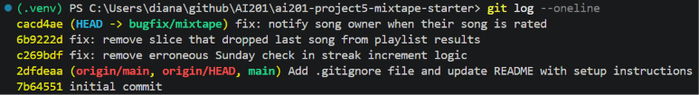

# Mixtape Bug Hunt — Submission

## AI Usage

I used Claude Code throughout this project for codebase navigation and debugging, working alongside Claude (chat) as a step-by-step guide.

- **Codebase orientation:** Asked Claude Code to summarize the architecture (models/routes/services) and trace the full data flow of "add song to playlist → notification" before touching any bug. This gave me the codebase map above and also surfaced bug #4's likely location as a side effect of tracing that flow.

- **Bug investigation:** For each bug, I asked Claude Code to explain the suspicious function first (without fixing), then to help me reproduce it via `flask shell` with real seeded data before changing anything.

- **Where AI's first hypothesis was wrong and I had to verify:** For bug #3 (search duplicates), Claude Code correctly predicted that an `outerjoin` with `song_tags` and no `.distinct()` would produce SQL-level duplicate rows — and confirmed 3 raw rows existed for a 3-tag song. But when we ran the actual `search_songs()` function, it returned only 1 result, not 3. Claude Code investigated further and found that SQLAlchemy's legacy `Query.all()` API auto-deduplicates ORM entities by primary key, even when the underlying SQL has duplicate rows — something its first read of the code didn't account for. Same thing happened with bug #2 (feed showing "yesterday's" people): the hypothesis was a tz-aware/tz-naive mismatch in the datetime comparison (by analogy with bug #1), but a direct test with a 30-hour-old event showed the filter correctly excluded it. Both hypotheses were reasonable reads of the code, but neither survived being tested against real data — so I moved on to other bugs (#5 and #4) rather than keep guessing, per the project's own reproduce-before-fixing principle.

- **What I verified myself:** For every bug I did fix, I ran the reproduction script before and after the fix myself in `flask shell` to see the actual output, rather than trusting Claude Code's explanation alone.

## Codebase Map

**Main files:**
- `app.py` — Application factory that initializes SQLAlchemy and registers the 4 blueprints (/songs, /playlists, /users, /feed)
- `models.py` — SQLAlchemy models: User, Song, ListeningEvent, Rating, Playlist, Notification
- `routes/` — Thin HTTP layer: validates input and delegates to services, no business logic
- `services/` — All the real logic (search, streak, feed, notification, playlist)

**Data flow — song added to playlist → notification:**
POST /playlists/<id>/songs → routes/playlists.py::add_song() → services/notification_service.py::add_to_playlist() → creates a Notification if song.shared_by != added_by_user_id → GET /users/<id>/notifications retrieves the list.

**Pattern noticed:** every route delegates immediately to a service function; all business logic lives in services/.

---

## Bug #1: Streak resets to 1 on Sundays instead of incrementing

- **How I reproduced it:** Using `flask shell`, set a seeded user's (`nova`) `listening_streak` to 5 and `last_listened_at` to a Saturday. Called `update_listening_streak(user, sunday)` simulating them listening again the next day (Sunday). Streak reset to 1 instead of incrementing to 6, confirming the bug. Ran a control test with Monday instead of Sunday — streak correctly incremented to 6 — isolating the bug to Sundays specifically.

- **How I found the root cause:** Read `update_listening_streak` in `services/streak_service.py` (lines 42-78). The docstring only documents one rule for incrementing: `days_since_last == 1`. Line 73 had an extra condition: `elif days_since_last == 1 and today.weekday() != 6:`.

- **The root cause:** Python's `date.weekday()` returns 6 for Sunday. The condition `today.weekday() != 6` made the increment branch only run when today isn't Sunday — so if a user listened yesterday and today happens to be Sunday, the combined condition evaluates to False and the code falls through to the `else` branch, resetting the streak to 1 even though the user met the documented "listened yesterday" rule. Nothing in the docstring justifies a Sunday exception — it looks like a leftover from an unfinished "weekends don't count" rule.

- **My fix and side-effect check:** Removed `and today.weekday() != 6`, leaving `elif days_since_last == 1:`. Re-ran the same reproduction after the fix — streak now correctly increments to 6 on Sunday. Confirmed the `days_since_last == 0` (no change) and `days_since_last > 1` (reset to 1) branches were untouched and still behave the same.

## Bug #4: No notification when a song is rated

- **How I reproduced it:** Using flask shell, had a user ("darius") rate a song owned by another user ("nova") via `rate_song()`. Counted `nova`'s notifications before (1, from a seeded playlist-add) and after the rating call (still 1) — confirming no notification was generated for the rating.

- **How I found the root cause:** Compared `rate_song` and `add_to_playlist` in `services/notification_service.py` line by line, since both follow the same pattern (load entities, perform the action, notify the original sharer if someone else acted). `add_to_playlist` (lines 64-70) has a block that checks `song.shared_by != added_by_user_id` and calls `create_notification(...)`. `rate_song` saves the Rating and commits (lines 101-108) but never has an equivalent block — it just returns.

- **The root cause:** `rate_song` is missing the notification branch entirely. It's not a broken comparison or typo — the code that saves the rating works correctly, but the architectural pattern used elsewhere in the file (notify the song's original sharer when someone else interacts with their song) was never implemented for the rating action, only for the playlist-add action.

- **My fix and side-effect check:** Added, after the commit and before the return, a block mirroring `add_to_playlist`'s pattern: `if song.shared_by != user_id: create_notification(user_id=song.shared_by, notification_type="song_rated", body=f"{rater.username} rated your song '{song.title}' {score}/5.")`. Re-ran the reproduction — `nova` now has 2 notifications after the rating, including one of type `song_rated`. Confirmed the existing `song_added_to_playlist` notification still fires correctly and rating save/update logic (lines 85-108) was untouched.

## Bug #5: Last song in a playlist never appears

- **How I reproduced it:** Using flask shell, queried the seeded playlist "Late Night Vibes" directly against the `playlist_entries` table — confirmed 7 real rows (positions 1-7, last being "Free Throws"). Called `get_playlist_songs()` on the same playlist and got only 6 results — "Free Throws" (position 7) was missing every time.

- **How I found the root cause:** Read `get_playlist_songs` in `services/playlist_service.py` (lines 38-66). The query itself (lines 58-64) correctly selects and orders all songs by position — no LIMIT or filter. The final return line, `[song.to_dict() for song in songs[:-1]]`, applies a Python slice that drops the last element of the already-correct list.

- **The root cause:** `songs[:-1]` returns all elements except the last one. Since `songs` is ordered ascending by position, the last element is always the most-recently-added song — so it's the highest-position song that gets silently dropped every single time, regardless of playlist size. This directly contradicts the function's own docstring, which states it returns "all songs in the playlist."

- **My fix and side-effect check:** Changed the return line to `[song.to_dict() for song in songs]`, removing the slice. Re-ran the reproduction — `get_playlist_songs()` now returns all 7 songs, including "Free Throws." Checked that ordering by `position` was unaffected (still ascending, unchanged query) and that empty/single-song playlists aren't affected differently, since the slice removal doesn't change behavior for any other index.

## Commit Log

